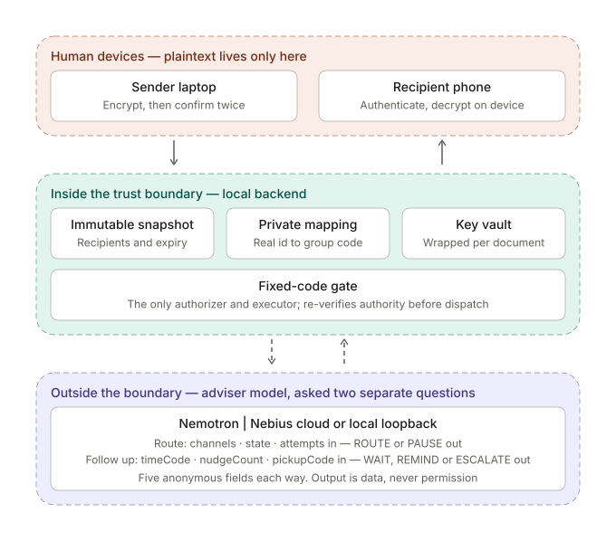
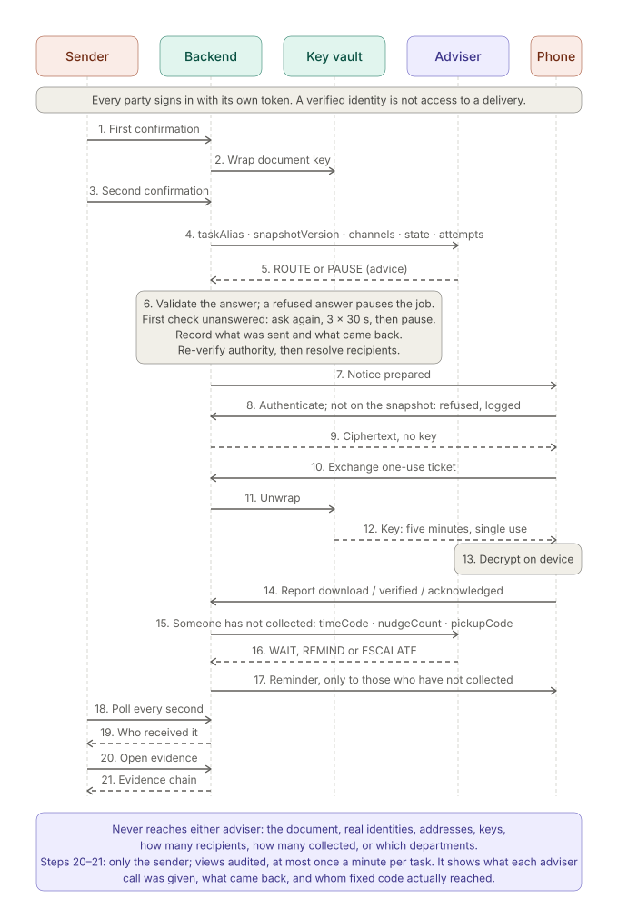
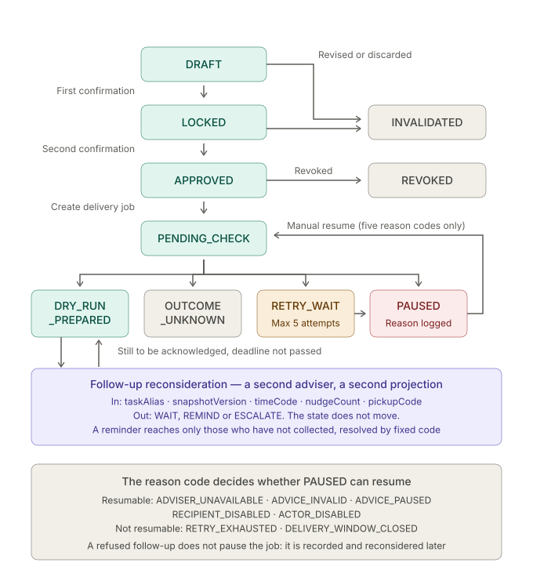

# Zero-Trust Edge Enclave

MIT-licensed local hackathon prototype for encrypted document handoff with a restricted AI adviser. Extracted from the Shared Room MCP direction; not a production security certification.

## Why This Boundary

Data residency rules, the US CLOUD Act and EU AI Act Article 10 make "send the document
to an API" the wrong answer for regulated material. The usual response is to move every
workload on-premises. This prototype takes the other route: keep the workload where it
is and bound what crosses.

What crosses to the model: `taskAlias`, `snapshotVersion`, `channels`, `state`,
`attempts`. Five pseudonymous workflow fields, validated by exact-key and format checks;
anything else is rejected before dispatch.

What never crosses: the document, the recipient, the address, the key.

The adviser's small surface is the design, not an unfinished part. A model is the
component an injected instruction attacks, so it cannot also be the component that
enforces the boundary. Work on tool-using agents converged on the same answer between
2024 and 2026 — enforce with deterministic policy outside the model rather than training
it to refuse — and supervision is moving the same way, with FINRA treating AI agents as a
distinct risk category and the AI AGENT Act of 2026 requiring human approval for
sensitive transactions. The backend here re-verifies identity, authorization, revocation,
snapshot version, channel allowlist, expiry and retry budget on every dispatch, and the
whole workflow completes with `COORDINATOR_PROVIDER=synthetic_fixture` and no model at
all.

Limits: this is a local prototype, not a certified deployment. There is no independent
KMS or TEE. The five metadata fields do reach Nebius Token Factory; only the document
content, recipient identity, address and keys are kept inside the boundary.

## Current Workflow

1. Import a sender credential and choose an existing authorization.
2. Select DOCX, PDF or CSV bytes (up to 5 MiB). Browser encryption happens without a document-content preview.
3. Review department-filtered recipients and channels. Confirm twice against the same immutable snapshot; changes require fresh confirmation.
4. A backend worker prepares simulated email notices with bounded retries. AI advice passes fixed authorization checks.
5. The authenticated recipient obtains ciphertext and a separate short-lived, one-use key ticket, decrypts in the browser and downloads the original file.
6. Receipt reports distinguish verification, download request and acknowledgement. None proves reading or legally effective delivery.

The SOC audit page also shows each delivery's evidence chain to its sender: what was approved, the
private mapping, exactly what every adviser call was given (stored at the time of the call, with a
computed check that no real identifier appears in it), what the adviser answered or why its answer
was refused, and how fixed code mapped the outcome back to real recipients, key releases and
receipts. Pages show a token as IDENTITY VERIFIED once the server recognises it, and a recipient's
access as APPROVED or DENIED only on the server's own decision: authentication and authorization are
shown apart.

REQUIRED_ACK adds no extra file cutoff but never bypasses grant expiry or revocation. TIME_LIMITED rejects new access at its approved deadline. Released bytes, keys and plaintext cannot be recalled.

## Run Locally

Requires Node.js 20.11 or newer; no third-party Node runtime packages.

```bash
npm run setup:local
npm test
SKIP_LOCAL_ENV=true LOCAL_ONLY=true npm run dev
```

Open http://127.0.0.1:3344/ or http://127.0.0.1:3344/zh-TW/. The language button switches the current page without reloading.

Import generated operator.token on the sender page and select local-review. Import recipient-a.token on the recipient page; recipient-b is intentionally unauthorized. Setup generates private random tokens and refuses existing files. These are local bearer identities, not enterprise SSO.

For a separate departmental demo with an administrator:

```bash
node scripts/setup-local.mjs data-business --business
SKIP_LOCAL_ENV=true LOCAL_ONLY=true DATA_DIR=data-business npm run dev
```

Use a new private directory and a free port. Do not share a running server's data directory. Import admin.token only on admin.html for department, person and grant administration. Business setup provides procurement and audit grants.

## NVIDIA / Nebius

Two NVIDIA open models sit behind one contract. `nvidia/nemotron-3-super-120b-a12b` is served by
Nebius Token Factory. `nvidia-nemotron-3-nano-4b` runs on the same machine as the backend through
any OpenAI-compatible local runtime. Switching between them is configuration, not a code change:
the metadata projection, the system boundary, the output schema and `validateFileAdvice` are
identical for both, and only the endpoint rule differs.

That rule is where the two outlets stop being interchangeable. The Token Factory outlet accepts
`https` to `api.tokenfactory.nebius.com` with no port, a backend key, and a model name beginning
`nvidia/`. The local outlet accepts loopback hosts only, because a non-loopback host would make an
external call wearing a local name. It also asks for the schema differently: the runtime rejects
`json_object` and takes `json_schema`. On the runtime measured 2026-09-18 the constraint was what
stopped the model reasoning aloud before it answered. Unconstrained, Nemotron Nano spends 500 to 1000 tokens deliberating and takes 8
to 36 seconds; constrained, it answers in 64 to 73 tokens and under 4.2 seconds. Since 2026-09-24
LM Studio applies the schema only after reasoning, so the local outlet now also sends
`reasoning_effort: "none"` and temperature 0: 0 reasoning tokens, 40 of 40 accepted at 2.3 to 2.7
seconds per call.

Neither is the boundary. `validateFileAdvice` decides what is valid, and a schema the server honours
only means fewer answers reach it malformed.

Where Token Factory carried the work: a 120B-class model was reachable over a plain
OpenAI-compatible endpoint, so no GPU had to be provisioned, no weights served and no bespoke client
written. That endpoint shape is also what made the two-outlet design possible at all. One request
builder reaches a hosted 120B model and a local 4B model without branching, so the comparison this
project needs -- a large hosted model and a small local one under identical constraints -- is a
configuration switch rather than two separate integrations.

No other Nebius service is used. There is no AI Cloud deployment, no Serverless Endpoint and no
Serverless Job. The application runs as a single Node process with no third-party runtime packages
and reaches Token Factory over the chat completions API.

Default mode is `synthetic_fixture` and issues no model request. Real file-task advice requires
`LOCAL_ONLY=false`, `COORDINATOR_PROVIDER=nebius` and a backend `NEBIUS_API_KEY`; a key alone does
not enable it. Configure an untracked environment file using `env.sample`, and start without
`SKIP_LOCAL_ENV=true` only when deliberately loading that private configuration. Never place secrets
in Git, browser code or model context.

The hosted instance has a Token Factory spending cap. Once it is spent, the advisers fall back to
synthetic advice and every other step keeps working; the current state is under `nebiusBudget` in
`/api/health`.

Two decisions sit behind that contract, each with its own five-field projection and its own
validator. Routing is asked whether a prepared job should go out on an approved channel or hold:
`taskAlias`, `snapshotVersion`, `channels`, `state`, `attempts`, answered with `ROUTE` or `PAUSE`.
Follow-up is asked what to do about a delivery that must be acknowledged and that nobody has
collected: `taskAlias`, `snapshotVersion`, `timeCode`, `nudgeCount`, `pickupCode`, answered with
`WAIT`, `REMIND` or `ESCALATE`.

Neither adviser can read documents, addresses, real identities or keys, change recipients, extend
expiry or authorize execution, and neither is told who the recipients are, how many there are, or
how they are grouped. The follow-up projection is starved further still: `timeCode` is a position in
the task's own window rather than a time, so an identical value means a different hour on a two-day
task and a two-month one, and `pickupCode` is `PICKUP_NONE`, `PICKUP_SOME` or `PICKUP_ALL`, never a
count. Fixed code decides who a reminder reaches, resolving it from receipts the adviser never saw.

Real provider calls, input rejection and injected-output gate tests were recorded separately during
development, including earlier failed calls and their successful retests. One earlier conclusion was
wrong and is corrected here rather than quietly dropped: constrained decoding on the local runtime
was recorded as returning empty content, when it returns a complete and correct answer assembled
into `reasoning_content` while `content` is left empty. A client reading only `content` sees an
empty success. None of these results prove superiority to deterministic routing, general injection
resistance, or compatibility with an untested local runtime.

Version 2026-09-25. Test evidence at this revision: 113 of 113, thirty consecutive runs.

## Architecture

Three views. Each is drawn from the implementation, not from intent: the state names come from the
audit allowlist in `audit-boundary.js`, the resumable reason codes from `task-operations.js`, and the
adviser projection from `file-routing.js`.

**What each party can reach.** Plaintext exists only on the two human devices. The adviser sits
outside the boundary and is reached by two dashed edges and nothing else.



**The order things happen in.** Nineteen messages from browser-side encryption to receipt reporting.
The adviser appears twice and nowhere else: once at step 5 to choose a route, and again at steps 15
and 16 when a delivery that must be acknowledged has not been collected. It is absent for the key
exchange, the decryption, and the reporting in between.



**What a task can do next.** Ten states and the reason codes that decide whether a paused job may
resume. `RETRY_EXHAUSTED` and `DELIVERY_WINDOW_CLOSED` both stop a job, for different reasons: the
first has spent its attempts, the second still has attempts but the download window closed first.



Polling is drawn as polling. The sender's page asks the backend once a second; there is no push
channel, and none is claimed.

The stdio MCP adapter exposes metadata-only file_status/file_recommend and legacy compatibility tools. It cannot deliver file bytes or release credentials. See [MCP permissions](MCP_SERVER_ALLOWLIST.md).

Backend storage includes ciphertext AND wrapped keys. The key service shares the app host and process: a compromised backend is outside this prototype's protection boundary. No independent KMS or hardware enclave is claimed.

## Verification And Limits

```bash
npm run check
npm test
node scripts/generate-business-fixtures.mjs
```

Tests use isolated synthetic stores and no provider requests. The fixture generator creates synthetic CSV and native-document source data, never reads user documents, and refuses differing existing outputs. Optional native rendering/browser testing is documented in [local workflow](docs/agent/local-workflow.md).

Email remains dry-run. No enterprise identity, malware inspection of ciphertext, legal signature or multi-host delivery guarantee is implemented. Legacy text/passphrase endpoints are compatibility paths, not this file workflow.

[Security](SECURITY.md) | [Threat model](THREAT_MODEL.md) | [Release review](docs/agent/security-gate-summary.md) | [Export manifest](public-export-manifest.md)

A hosted instance for judges runs at https://zero-trust-edge-enclave.zeabur.app behind a judge sign-in; the sign-in and the role tokens are in the submission's testing instructions. See [Zeabur deployment](docs/agent/zeabur-deployment.md).
