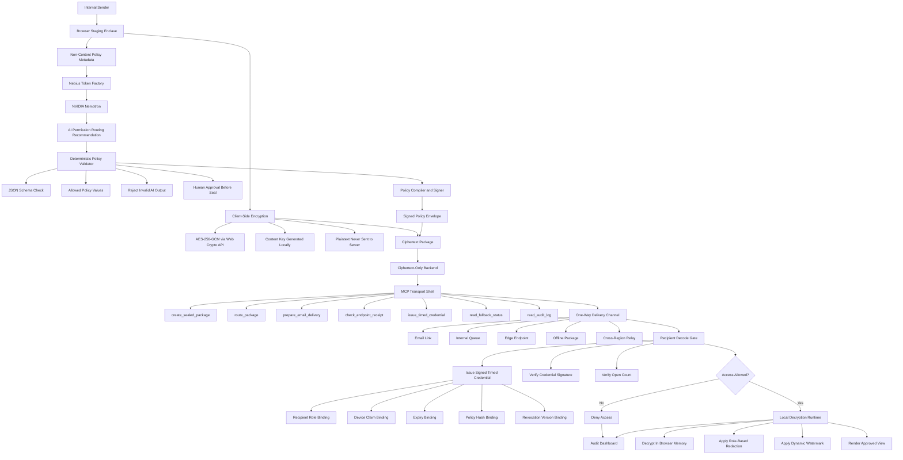

# Zero-Trust Edge Enclave

AI-native policy control plane for encrypted internal data delivery.

This project is a new hackathon-oriented framework extracted from the Shared Room MCP direction. The original project focused on shared commercial intake rooms. This project focuses on enterprise internal data delivery: client-side encryption, ciphertext-only relay storage, policy-bound decode gates, and audit evidence.

## Hackathon Fit

- Track: Best Apps and Agents Track.
- Nebius role: Token Factory inference endpoint for policy recommendation.
- NVIDIA role: Nemotron model for permission routing and access-policy suggestions from non-content metadata.
- Security boundary: AI suggests policy but never receives plaintext, content summaries, snippets, or payload encryption keys.

## MVP Pages

1. Sender Enclave: stage internal content, send only non-content policy metadata to the policy assistant, encrypt locally in the browser, then create a sealed package.
2. Recipient Decode Gate: open a sealed package as an authorized or unauthorized recipient, validate policy claims, and decrypt locally only when allowed.
3. SOC Audit Dashboard: inspect ALLOW and DENY events, package hashes, policy summaries, and runtime mode.

## Timed Access Credential

The decode path uses a signed timed credential instead of a permanent password or direct role check. The credential binds:

- package id
- package hash
- policy hash
- recipient role
- device claim
- expiry
- one-use claim
- revocation version

The server releases ciphertext to the local decryption runtime only after the signed credential passes validation. The demo passphrase is only for browser-side AES-GCM key derivation during the local MVP; it is not a production KMS design.

## MCP Transport Shell

The MCP-style shell is a secure package transport layer. It can route and monitor sealed packages, but it cannot inspect plaintext, decrypt content, hold keys, or approve final access.

Current local tool surface:

- `create_sealed_package`
- `route_package`
- `prepare_email_delivery`
- `check_endpoint_receipt`
- `issue_timed_credential`
- `read_fallback_status`
- `read_audit_log`

Tool schemas are exposed at `GET /api/mcp/tools`. Tools are called through `POST /api/mcp/call`.

## One-Way Email Dry Run

The local MVP prepares an email-safe delivery notice but does not send mail. The generated notice includes only:

- sealed package id
- classification and risk level
- expiry
- allowed roles
- Decode Gate link

It does not include protected content, ciphertext, cryptographic keys, IV, or salt. Real email delivery must be added later behind a separate secret-handling and outbound-review gate.

## Architecture



## Run Locally

```bash
npm run check
npm run dev
```

Open `http://127.0.0.1:3344`.

## Nebius Configuration

Copy `env.sample` to `.env` or export equivalent variables in the shell.

```bash
export NEBIUS_API_KEY="your_token_factory_key"
export NEBIUS_BASE_URL="https://api.tokenfactory.nebius.com/v1"
export NEBIUS_MODEL="nvidia/nemotron-3-super-120b-a12b"
```

When `NEBIUS_API_KEY` is missing, the app uses an explicit local demo fallback and labels the result as `demo_fallback`. This is useful for UI development but is not submission evidence.

The server loads `.env` from the project directory first, then from the parent workspace directory when a variable is still missing. Keep both `.env` locations untracked and never commit secrets.

For production-like runs, set `TOKEN_SIGNING_SECRET`. Local development without this variable uses an ephemeral per-process signing secret so demo credentials expire when the server restarts.

## Public Submission Boundary

The repository should stay private during build work and become public only for Devpost review. Public export allows source code, architecture, threat model, and security evidence files. Public export denies `.env`, `.env.*`, runtime `data/*.json`, local `logs/`, signed credentials, provider keys, and confidential payload samples.

See `public-export-manifest.md`, `SECURITY.md`, `THREAT_MODEL.md`, and `MCP_SERVER_ALLOWLIST.md` before changing repository visibility.
