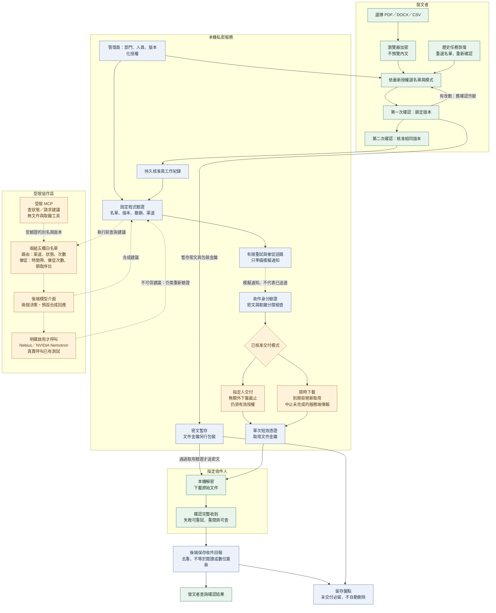

# 收斂版密件交付架構

更新：2026-09-19（原 2026-09-08；新增投遞催促顧問）。範圍：單一本機服務、合成名單、email dry-run。真實 Nebius Token Factory／NVIDIA Nemotron 受限呼叫已有隔離測試證據；預設仍為本地合成回應，並非預設上雲。沒有多地協調、數位簽章或發文者二次回覆協議。真實寄送、企業 SSO、獨立 KMS 與地端模型實測不在本輪交付範圍。

本圖表示原始碼已實作的界線，不代表現有預覽程序已載入最新模型提示詞，也不代表 GitHub 已發布。實線為本地流程，虛線為受限建議或模擬通知；不是物理單向網路。

## 定版流程

## 不變邊界

- AI 不取得文件、摘要、密文、真實名單、私密映射、金鑰或憑據。只能提出既有允許渠道的建議；固定程式重新驗證。
- 有兩組五欄投影，各自獨立驗證。路由：taskAlias、snapshotVersion、channels、state、attempts，回答 ROUTE 或 PAUSE。催促：taskAlias、snapshotVersion、timeCode、nudgeCount、pickupCode，回答 WAIT、REMIND 或 ESCALATE，僅適用於 REQUIRED_ACK 且期限未到的投遞。
- timeCode 是該任務自身窗口的相對位置，pickupCode 是序位不是數量，兩者都推不回時鐘值或人數。提醒要送給誰由固定程式從收據還原，顧問看不到，已領取者直接跳過。真實模型須同時明確設定 LOCAL_ONLY=false、COORDINATOR_PROVIDER=nebius 與後端金鑰；僅放金鑰不會啟用。MCP 與模型不是同一元件，MCP 不直接觸發檔案交付。
- 路由階段：模型回答先經固定程式驗證；輸出無效（ADVICE_INVALID）或建議暫停（ADVICE_PAUSED）立即 PAUSED。首次路由檢查（PENDING_CHECK）模型連不上時工作維持 PENDING_CHECK，30 秒後再問，最多 3 次（已在 RETRY_WAIT 的投遞連不上則直接 PAUSED），仍不可用才 PAUSED（ADVISER_UNAVAILABLE，可由發文者申請恢復，恢復後重試次數歸零）；請求尚未送出就失敗（出口停用或設定錯誤）不重試。催促階段不同：被拒絕或不可用只記錄 followupPausedBy 並延後重新考慮，前三次各隔一分鐘，之後改為剩餘時間的一半；狀態維持 DRY_RUN_PREPARED，不會把工作推進暫停；全員都已領取就不再詢問模型。兩者都不宣稱雲端中斷就自動改接地端模型，權限有效性在模型前後都重查。
- 每次顧問呼叫（含失敗）都存入該工作的證據紀錄：送出的投影、通過驗證的回答或拒絕碼、回答來源（Token Factory／本機出口／合成測試）；路由與催促各保留最近 10 筆。發文者（且僅發文者）可在稽核頁開啟證據鏈：核准內容 → 私有映射 → 模型收到什麼 → 回答了什麼 → 固定程式實際派送給誰；查看本身寫入稽核（同一任務每分鐘最多一筆）。
- 兩次確認屬於同一發文者，不是雙人覆核或 MFA。版本、名單或授權有變動，就不能沿用舊確認。
- 已核准快照不被覆寫；新審核建立新版本。授權失效或撤銷後，不可用新版本名義繼續舊版本取用。
- 指定人模式不另加 1／4／24 小時的文件下載限制，但不繞過真實授權期限或撤銷。授權續接需要管理員有效授權與發文者重新確認。
- 限時模式的截止與回報狀態分開。到期後仍可記錄已發生的收件確認，但不能藉回報重新取得文件或金鑰。
- 只能停止尚未由服務送出的資料；已送達、已取得的金鑰或明文副本不能遠端收回。
- 回報失敗最多自動嘗試三次，再由收件人重試。後端已有紀錄時，重新開頁可恢復確認，不再取鑰。後端完全沒有紀錄時不能憑空認定已收到。
- 金鑰模組與服務同機，不是獨立 KMS、TEE 或保證伺服器不能解密的架構。
- 留存功能只盤點：未交付、有效取用、未解決任務、草稿及待寫入稽核均保留。可清理候選仍需另行審核；本輪沒有刪除介面。

## 本機驗收

詳見同專案的 Local Workflow 文件與既有開發紀錄。測試覆蓋原檔位元組還原、兩次確認、草稿恢復、授權更新、指定收件人隔離、到期 API 拒絕、HTTP 慢速傳輸中止、回報遺失與重試，以及管理與留存盤點。

最近隔離驗收：49 項自動化測試通過；瀏覽器完成發文端憑據匯入、部門映射、兩次核准、收件端憑據匯入、CSV／DOCX／PDF 原檔下載與回報。這些是已記錄的前次驗收，本次圖面收尾沒有重新呼叫模型。

## 剩餘交付缺口

| 優先級 | 狀態 | 下一步 | 是否等官方 |
| --- | --- | --- | --- |
| P1 | 待人工核准 | 審核掃描誤報例外，不能把原始告警改成零告警 | 否 |
| P1 | 待發布審查 | 因本圖更新，重新建立副本、掃描並檢查 Git 待送內容與歷史 | 否 |
| P1 | 待錄影準備 | 控制重啟並確認預覽版本，再錄英文或附英文字幕的操作影片 | 否 |
| P1 | 待官方答覆 | 確定免費評審試用與本地交付方式；再決定是否需要託管版本 | 是 |
| P2 | 待完成 | 整理平台回饋、先前專案沿用與本次新增的日期說明 | 否 |

此表是交付缺口，不新增多地部署、真實寄信或地端模型功能。完整責任、證據與下一步以既有開發歷程的最新收尾佇列為準。未取得使用者發布確認前，不上傳 GitHub。

測試通過不代表真實 email 送達、雲端部署、醫療或金融合規認證。這些不是本輪完成條件。
